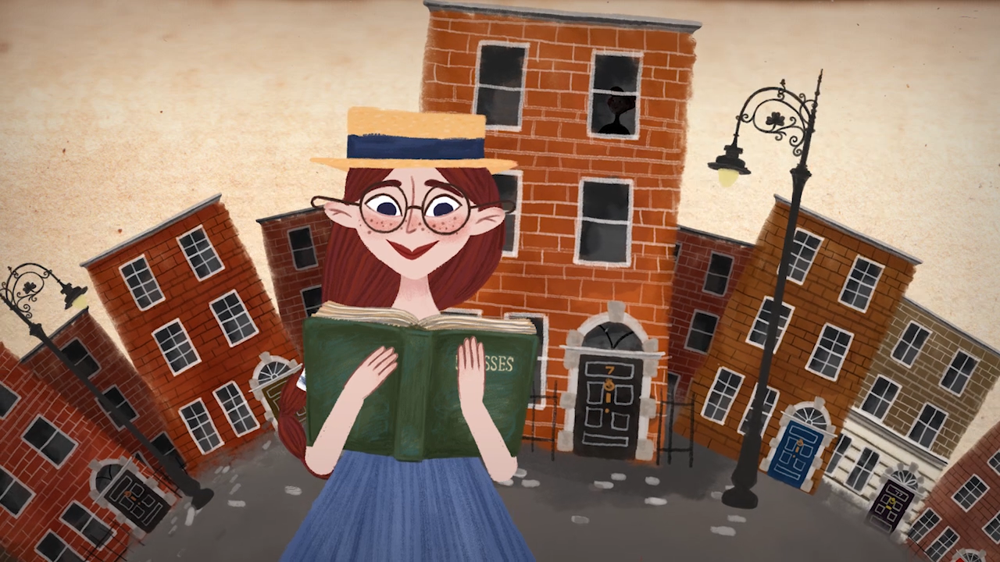

# My Experience
### Three things I found hard:

1. I initially struggled with working in an RMarkdown document. I couldn't get the chunks to work as I was missing {r chunk-name} step. That took up a lot of time. But I've now figured it out. 
2. I had trouble understanding what an array is. It felt very non-intuitive but the assignment challenge was great help!
3. I couldn't understand how to do challenge 1 at first. I tried the str_split() function and that didn't work because I was missing a space in one of the arguments. But I figured it out! Looking at my peer Jess' code helped. 

### Three things I learnt from Peer Commentary: 

1. I got a reminder to use the str() function. 
2. I learnt that fun, aesthetic things matter. People loved that I included a graphic. 
3. I also learnt that sometimes, having all of the output can hinder readability of the document. 

### Things I liked from my peers' work:

1. I loved how Brooke wrote all her thoughts and work-flow instructions in her markdown file.  
2. I love how Jess tried two separate ways to do Challenge 4. 

### Things that could use improvement: 

I think both of them did a great job. I only had minor comments about their work. 

# Response to Peer Commentary:

-Hey, do something cool in your yaml.
-DONE!

-I liked how you outlined your goals so clearly!
-Thank you!

-Woah, your graphic is very fun. I will do that next time.
-Thank you!

-R Challenge 1: I would eliminate the step of removing the punctuation.
-I'm not acting on this part of the peer commentary because I just did it to learn the step. However, Jess helped me understand the str_split() function, which is a more efficient way in my opinion. So I'm including a code for that here. Just for my practice. 

-R Challenge 3 (step one): is there a way you can make the RMD only show certain lines and not all of them? This way it would be easier to see/ you wouldn't have to scroll so far down.
-Done, I asked the output to only show the ,,1,1 matrix as the output. 

-R Challenge 5 (last step): Interesting method! You just did not use the Str function.
-Done. This was a very useful reminder. 

# Peer Commentary:

-Hey, do something cool in your yaml. 

-I liked how you outlined your goals so clearly!

-Woah, your graphic is very fun. I will do that next time.

-R Challenge 1: I would eliminate the step of removing the punctuation.

-R Challenge 3 (step one): is there a way you can make the RMD only show certain lines and not all of them? This way it would be easier to see/ you wouldn't have to scroll so far down.

-R Challenge 5 (last step): Interesting method! You just did not use the Str function.


```{r setup, include=FALSE}
knitr::opts_chunk$set(echo = TRUE)
```

# Homework 1 for AN/BI 588: Push It! 

The goal of the homework is to demonstrate our knowledge and understanding of using an intergrated version of RStudio and Github in a collaborative way

For this, we need to follow the following steps: 

1. Create a Github repo called AN588-Week-2-BUlogin (Here's the link to mine! https://github.com/bhavya-dv/AN588-Week-2-vbhavya)
  
  Make your group members and Chris a collaborator on the repo. The group members will share comments about your work and you will do the same. This is an exercise in sharing your work with others. 
  
2. Create a new project on RStudio, and connect the repo from Github to RStudio. We have already done these steps in Module 3, Step 4, Version 1. Link here: https://fuzzyatelin.github.io/bioanth-stats/module-03/module-03.html#Step_4,_version_1_-_Creating_a_new_R_project_by_cloning_a_remote_repository_on_GitHub

3. Make an RMarkdown file with the challenges from Module 3. Push it! and wait for your peers to share their comments. 

## Challenge 1

Goal: To make a vector of 1-word character strings with words from the first sentence in James Joyce's Ulysses. Then, extract every third element from the vector. 

```{r Ulysses, echo=FALSE, out.width = '50%', fig.align ='center'}

```

    The above graphic is meant to be part of the prettification challenge!

To achieve the goals of Challenge 1, I used the function seq(), which uses a general sequence (named ulysses, in our case) and gives a subsequence which can be in increments of the general sequence. This is what we're doing here. We are asking the seq() function to go through the 1st to 22nd elements of "ulysses" and give us a subset which is every third increment of the original vector. 

``` {r challenge1}
#creating a vector with the sentence 
ulysses <- c("Stately",",","plump","Buck","Mulligan","came","from","the","stairhead",",","bearing","a","bowl","of","lather","on","which","a","mirror","and","a","razor","lay","crosed",".") 

#removing all punctuation
ulysses <- gsub("[[:punct:]]","",ulysses) #replaces punctuation with empty string?

library(stringi) #stri_remove_empty(), used below, is in package stringi
ulysses <- as.character(stri_remove_empty(ulysses, na_empty = FALSE)) #removes empty strings from a vector
ulysses #ulysses is now a vector with no punctuation

req_ul <- ulysses[seq(from = 1, to = 22, by = 3)] #the required set of every third string

req_ul
```

# Challenge 1, Version 2
The version 2 below is an alternate way of doing challenge 1. Instead of inputting each word of the sentence as a string in the vector, we can just input the whole sentence, and use the str_split() to split the sentence vector into multiple strings. This is particularly useful if we are copy-pasting sentences from somewhere. We may not be able to always input all the words. 

```{r challenge1-2}
ulysses1 <- c("Stately, plump Buck Mulligan came from the stairhead, bearing a bowl of lather on which a mirror and a razor lay crossed.")

library(stringr)

ulysses1 <- str_split_1(ulysses1, " ")
ulysses1[seq(from = 1, to = 22, by = 3)]
```
## Challenge 2

Goal: to create a n x m matrix using the matrix() function, where n = nrow, m = ncol, and populate it with numbers from 1 to 80. Then, extracting the mentioned, rows, columns and specific elements and assigning them to a variable x. 

It is important to note that usually, matrices in R are filled by column first. 

Note: the outputs when extracting rows and columns from matrices are also matrices. However, in the third case, we get a list of elements as an output. This is due to the nature of the command given. 

``` {r challenge2}
m <- matrix(data = 1:80, nrow = 8, ncol = 10, byrow = FALSE) #creating the matrix
m

#extracting the 2nd, 3rd, and 6th columns
x <- m[,c(2,3,6)] 
x
#extracting the 6th and 8th rows 
x <- m[c(6,8),]
x
#extracting elements from ow 2, column 2 to row 6, column 9
x <- m[2,2]:m[6,9]
x

```


## Challenge 3

Goal: To create a 4-D array populated with numbers counting down from 400 to 1. The dimensions of the array are (5x5x4x4). 

This created 4x4 5x5 matrices. 

What would the following commands give: 

  a. a[1, 1, 1, 2]
  
  My guess is that this will give the element [1,1] from the ,, 1,2 matrix
  
  b. a[2, 3, 2, ]
  
  My guess is that all [2,3] elements from all ,,2 matrices will be given. There should be a list of four elements
  
  c. a[1:5, 1:5, 3, 3]
  
  My guess is that the output matrix will just be the ,,3,3 matrix

``` {r challenge3}
a <- array(data = 400:1, dim = c(5,5,4,4))
str(a) # Peer commentary asked for a way to show only upto the first few lines of the output for visual clarity. This step is to jsut check if the entire array is what we need it to be
a[,,1,1] # new output

a[1, 1, 1, 2] # answer matches with guess 
a[2, 3, 2, ] # answer matches guess
a[1:5, 1:5, 3, 3] #answer matches guess
```

## Challenge 4
Goal: To create a list to simplify primate classification and taxonomy. The main learning from this is that lists can be used as elements within a list. 

Therefore, when tackling a challenge like this, when lists are nested within lists, it is best to start by creating the "innermost" lists first and then making your way outwards. 

```{r challenge4}

#starting with the "innermost" lists in Anthropoidea 
Platyrrhini <- c("Cebidae","Atelidae","Pitheciidae")
Catarrhini <- c("Cercopithecidae","Hylobatidae","Hominidae")
Anthropoidea <- list(Platyrrhini, Catarrhini)
names(Anthropoidea) <- list("Platyrrhini", "Catarrhini")
Anthropoidea # " Anthropoidea consists of two lists

Tarsioidea <- "Tarsiidae" #is at the same level as "Anthropoidea"

#Haplorhini is the next "level"
Haplorhini <- list(Anthropoidea,Tarsioidea)
names(Haplorhini) <- list("Anthropoidea", "Tarsioidea")
Haplorhini #consists of two lists, one is a list with two other lists as elements

#For Strepsirhini
Lemuroidea <- c("Cheirogaleidae", "Lepilemuridae", "Indriidae", "Lemuridae",
                "Daubentoniidae")
Lorisoidea <- c("Lorisidae", "Galagidae")
Strepsirhini <- list(Lemuroidea, Lorisoidea)
names(Strepsirhini) <- list("Lemuroidea", "Lorisoidea") #is at the same level as "Haplorhini" 
Strepsirhini 

primates <- list(Haplorhini,Strepsirhini)
names(primates) <- list("Haplorhini", "Strepsirhini")
primates

```

## Challenge 5

Goal: To make a matrix, that is filled by row (REMEMBER: R fills a matrix by column unless specified otherwise). And coerce matrix and matrix elements to other data structures. 

``` {r challenge5}
m3 <- matrix(data = c(3, 0, 1 ,23, 1, 2, 33, 1, 1, 42, 0, 1, 41, 0, 2), 5, 3, byrow = TRUE)
m3

#coercing matrix m3 to a data frame
df <- as.data.frame(m3)
df

class(m3) 
class(df) #confirming that df is a data frame

#converting column 2 to be logical valued
class(df$V2) #initially, class is numeric

df$V2 <- as.logical(df$V2)
class(df$V2) #now, class is logical

#converting column 3 to be factor valued
class(df$V3) #initially, it is numeric

df$V3 <- as.factor(df$V3)
class(df$V3) #now it is factor valued

str(df)
```